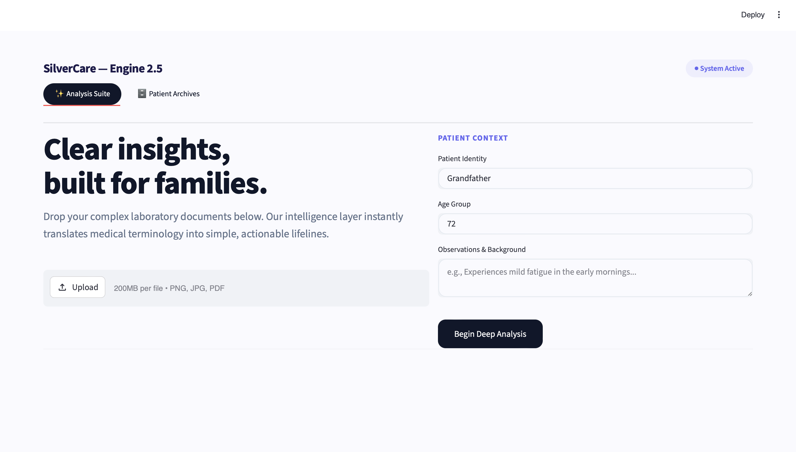

# SilverCare AI

SilverCare AI is an AI-powered healthcare intelligence assistant built to bring structural clarity, safety, and insight to family caregiving. Developed under the guidance of Sai Satish Sir (Indian Servers), this platform converts complex, unstructured clinical diagnostic reports into highly readable, bite-sized health snapshots for everyday families.

Instead of relying on fragile, error-prone traditional OCR systems, SilverCare AI utilizes a state-of-the-art vision-language engine to process both digital documents and casual smartphone snapshots seamlessly.

---


## Application Preview

### Main Insights Dashboard



---

## Key Features

* **AI Report Analyzer (Powered by Google Gemini)**
    Utilizes advanced multi-modal native vision-language processing to convert messy, unstructured medical reports into organized cards, key metric trends, and plain-English summaries.
* **Multi-Format Input Support**
    Seamlessly ingests digital hospital PDFs as well as hand-held smartphone camera photos of physical lab sheets without requiring pre-cropping or alignment.
* **Profile Integrity Engine**
    A proactive safety layer that instantly catches demographic mismatches (such as age or gender variances) between the caregiver's user input and the document text canvas to prevent critical medical mix-ups.
* **Interactive Historical Archives**
    Securely commits, logs, and tracks historical patient evaluation histories over time, allowing caregivers to look back at past records instantly.

---

## Technical Architecture & Stack

### Frontend & UI Layer
* **Streamlit (Python):** Powers the reactive single-page dashboard application, handling state management (st.session_state) and view switches seamlessly.
* **CSS3 Custom Injections:** Overrides base components to deliver a premium, scannable Bento-Grid layout system with high-visibility hazard highlighting.

### Artificial Intelligence Core
* **Primary Engine:** Google Gemini 2.5 Flash via the modern Google GenAI SDK for ultra-fast, multi-modal layout and text processing.
* **Resilient Fallback Pipeline:** Integrated Gemini 2.0 Flash automated lane routing to guarantee application uptime if primary API limits or timeouts hit.

### Data & Operations Layer
* **SQLite3:** A completely lightweight, local relational database that securely handles session logging, data persistence, and historical retrieval.
* **Pillow (PIL):** Validates and processes incoming raw image files before network pipeline transmission.
* **Python Native re (Regex):** Deterministically parses the model's structured payload into dedicated UI dashboard blocks.

---

## Repository Structure

```text
├── app.py                  # Main Streamlit Application Entrypoint
├── silvercare_records.db   # Local SQLite3 Relational Database 
├── requirements.txt        # Python External Dependencies Configuration
└── README.md               # System Documentation (This file)
